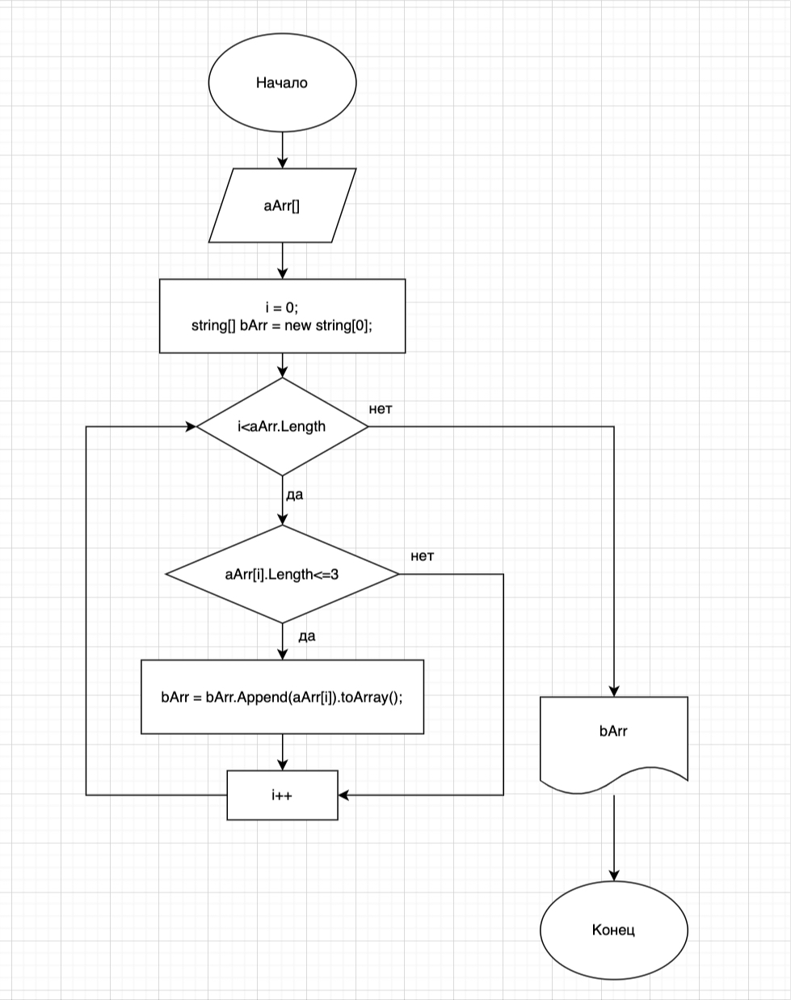

# Итоговая проверочная работа
## Выполнил студент @yakovpn
## Курс ЦП "Программист мобильных устройств"
## Описание задачи
Итоговая проверочная работа.
Данная работа необходима для проверки ваших знаний и навыков по итогу прохождения первого блока обучения
на программе разработчик. Мы должны убедиться что базовое знакомство с it прошло успешно.
Задача алгоритмически не самая сложная, однако для полценного выполнения проверочной работы необходимо:
* Создать репозиторий на GitHub
* Нарисовать блок-схему алгоритма (можно обойтись блок-схемой основной содержательной части, если вы выделяете ее в отдельный метод)
* Снабдить репозиторий оформленным текстовым описанием решения (файл README.md)
* Написать программу, решающую поставленную задачу
* Использовать контроль версий в работе над этим небольшим проектом (не должно быть так что все залито одним коммитом, кака минимум этапы 2, 3 и 4 должны быть расположены в разных коммитах)

**Задача:** Написать программу, которая из имеющегося массива строк формирует массив из строк, длина которых меньше либо равна 3 символа. Первоначальный массив можно ввести с клавиатуры, либо задать на старте выполнения алгоритма. При решении не рекомендуется пользоваться коллекциями, лучше обойтись исключительно массивами.

# Блок-схема:

